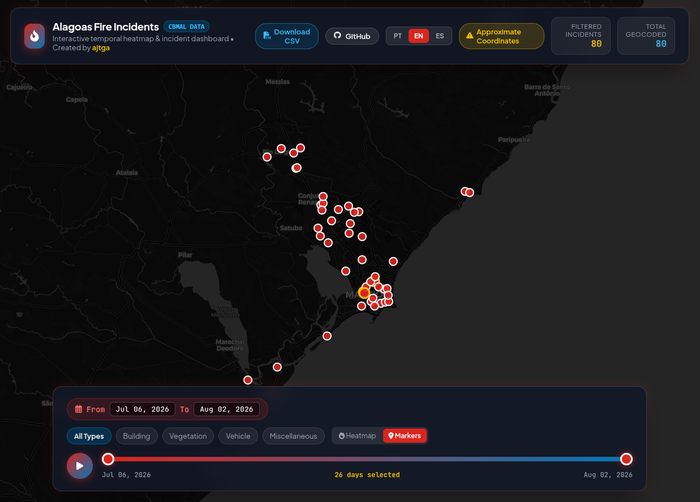

# CBMAL Fire Incidents Scraper

A lightweight tool to scrape, parse, and geocode fire incident reports published by **CBMAL** (*Corpo de Bombeiros Militar de Alagoas*).

The project aggregates incident data into a structured CSV dataset and enriches records with estimated latitude and longitude coordinates using automated geocoding.

---

## Context & Motivation

I needed historical, geocoded data on fire incidents in Alagoas for some regional analysis. After a thorough online search (including the CBMAL website and the [Alagoas Open Data Portal](https://dados.al.gov.br/catalogo/dataset?q=incendios)), it became clear that while the fire department registers incidents internally and satellite data (like INPE) tracks heat signatures, a public dataset of operational fire department responses in Alagoas simply isn't available without a formal legal request.

I used this lack of open data as an excuse to learn how to set up an automated scraper using GitHub Actions. This project fulfills two needs: acquiring the data I needed for my analysis, and picking up a new skill in the process.

The automated scraper went live on **July 10, 2026**. The dataset contains records starting from **July 6, 2026**, as data collected during manual test runs was kept.

---

## 🗺️ Interactive Heatmap & Temporal Dashboard

This repository includes a standalone web dashboard hosted via **GitHub Pages**:

👉 **[Launch Interactive Dashboard](https://ajtga.github.io/fire-incidents/)**

[](https://ajtga.github.io/fire-incidents/)

### Dashboard Features
- **Temporal Slider & Animation**: Play, pause, or step through dates to observe the spatial & temporal spread of fire responses over time.
- **Heatmap & Pin Views**: Toggle between an aggregate density **Heatmap** and individual incident **Markers**.
- **Incident Category Filters**: Filter by normalized incident type (*Building*, *Vegetation*, *Vehicle*, *Miscellaneous*).
- **Alagoas Regional Theme & Multi-Language**: Styled with the official colors of the Alagoas flag (`#DA251E` Red, `#0077B9` Blue, `#F8C300` Gold) across UI components, gradients, and density ramps. Includes a 3-way language selector (**PT-BR**, **EN**, **ES**) with compact locale-aware date formatting.
- **Incident Details**: Click any marker pin to view incident timestamps, detailed locations, city, responding vehicles, and personnel count.
- **Automated Sync**: Regenerated automatically every 6 hours by GitHub Actions whenever dataset updates occur.

---

## 📊 Data Access & Raw Dataset

The complete, cleaned, and geocoded dataset is available for public download in CSV format:

📥 **[Download Raw CSV Dataset](https://raw.githubusercontent.com/ajtga/fire-incidents/main/data/cbmal_fire_incidents.csv)**


## ⚠️ Disclaimer: Coordinate Accuracy

> **IMPORTANT**: The latitude and longitude coordinates in this dataset are **approximations** and must not be relied upon as exact locations.

In many cases, the original scraped reports simply do not provide enough location detail to make a precise estimate. Both automated geocoding (via OpenStreetMap's Nominatim API) and manual coordinate entries rely on limited context—often falling back to city centers, street centroids, or neighborhood areas when specific addresses are missing in the source data.

Always treat coordinates as **rough geographic estimates** rather than exact pinpoint locations.

---

## Project Structure

```
.
├── cbmal_fire_incidents_scraper.py   # Main web scraper & geocoding script
├── requirements.txt                  # Python dependencies
├── data/
│   ├── cbmal_fire_incidents.csv      # Main dataset containing scraped fire incidents
│   └── scraper_run_log.csv           # Execution log tracking scraper runs
├── docs/
│   └── index.html                    # Interactive Leaflet temporal heatmap dashboard
└── scripts/
    ├── generate_dashboard.py         # Standalone HTML dashboard generator script
    └── backfill_geocoding.py         # Utility script to backfill missing coordinates
```

---

## Getting Started

### Prerequisites

Python 3.9+ is recommended. Install required packages using:

```bash
pip install -r requirements.txt
```

### Running the Scraper

To fetch the latest occurrences, deduplicate records, geocode addresses, and update the dataset:

```bash
python cbmal_fire_incidents_scraper.py
```

### Generating the Interactive Dashboard

To regenerate `docs/index.html` from `data/cbmal_fire_incidents.csv`:

```bash
python scripts/generate_dashboard.py
```

### Backfilling Missing Coordinates

If existing records in `data/cbmal_fire_incidents.csv` are missing coordinates, run the backfill script:

```bash
python scripts/backfill_geocoding.py
```

---

## Dataset Schema

The main dataset (`data/cbmal_fire_incidents.csv`) includes the following columns:

| Column | Description |
| --- | --- |
| `incident_id` | Unique ID for the incident |
| `scraped_at_utc` | ISO timestamp of when the record was scraped |
| `orgao` | Responsible agency / unit |
| `data` | Incident date |
| `hora` | Incident time |
| `cidade` | City / Municipality |
| `tipo` | Category / Type of fire incident |
| `detalhe` | Additional incident details or descriptions |
| `local` | Location text / address snippet reported |
| `viaturas` | Number of vehicles dispatched |
| `militares` | Number of personnel dispatched |
| `latitude` | Estimated latitude coordinate |
| `longitude` | Estimated longitude coordinate |

---

## Scraping Strategy & Resilience

To handle the characteristics of the CBMAL server, we adopt a **fail-fast** scraping strategy:

- **Diagnostic Findings**: Log audits revealed that the CBMAL portal runs on a legacy stack (`Apache/2.4.25` and `PHP/5.6.40`) which experiences significant transient latency (baseline page fetch time is 5.5s to 8.5s). 
- **Fail-Fast Approach**: Rather than consuming multiple retries that increase load on the target server during outages, the scraper is configured to try **only once** per execution but with an increased timeout of **60 seconds**. 
- **Scheduling Intention**: The scraper runs on a strict **6-hour schedule** (`18 */6 * * *`). This frequency is maintained to prevent data loss from rolling occurrence lists. We explicitly choose **not** to skip runs if a previous run was successful in the past 24 hours.
- **Handling Failures**: Transient connection failures are accepted as expected server-side events, and subsequent scheduled executions naturally backfill missing data.

---

## Legal Basis & Data Sourcing

The collection and processing of public incident records from the State of Alagoas Military Fire Brigade (*Corpo de Bombeiros Militar de Alagoas - CBMAL*) is governed by the following Brazilian legal frameworks:

- **Access to Information Law (*Lei de Acesso à Informação* - Lei nº 12.527/2011)**: Under Article 8, public agencies are mandated to ensure active transparency and promote the availability of public information in automated, machine-readable formats.
- **Copyright Law (*Lei de Direitos Autorais* - Lei nº 9.610/1998)**: Article 8, IV explicitly excludes official acts, government communications, and public administration reports from copyright protection, placing them in the public domain for public interest reuse.
- **General Personal Data Protection Law (*Lei Geral de Proteção de Dados* - Lei nº 13.709/2018)**: The scraper extracts exclusively operational public safety metadata (incident categories, general location descriptions, dispatch counts, dates/times). It does not extract or process personal identifying data of private citizens.

---

## License & Attribution

This project adopts a dual-licensing structure to distinguish between the software code and the compiled dataset:

- **Software / Code**: The scraper scripts, utilities, and automation workflows are licensed under the [GNU General Public License v3.0 (GPL-3.0)](LICENSE).
- **Dataset**: The compiled fire incidents dataset (`data/cbmal_fire_incidents.csv`) is released under the [Open Database License (ODbL 1.0)](LICENSE-DATA) (see [online version](https://opendatacommons.org/licenses/odbl/)).
- **Attribution**:
  - Primary occurrence data is provided by [Corpo de Bombeiros Militar de Alagoas (CBMAL)](https://www.cbm.al.gov.br/).
  - Geocoding location data is powered by [OpenStreetMap](https://www.openstreetmap.org/copyright) contributors using the Nominatim API, available under the Open Database License ([ODbL](https://opendatacommons.org/licenses/odbl/)).


